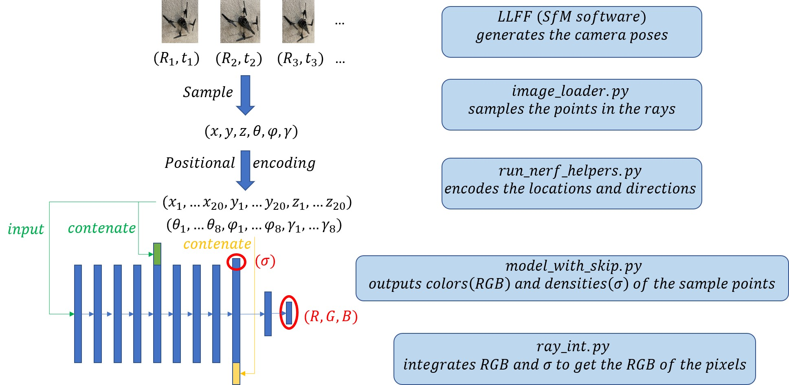

# NeRF: Neural Radiance Fields



## Running code
Run
```
python train_nerf.py
```

## Citation

```
@inproceedings{mildenhall2020nerf,
  title={NeRF: Representing Scenes as Neural Radiance Fields for View Synthesis},
  author={Ben Mildenhall and Pratul P. Srinivasan and Matthew Tancik and Jonathan T. Barron and Ravi Ramamoorthi and Ren Ng},
  year={2020},
  booktitle={ECCV},
}
```